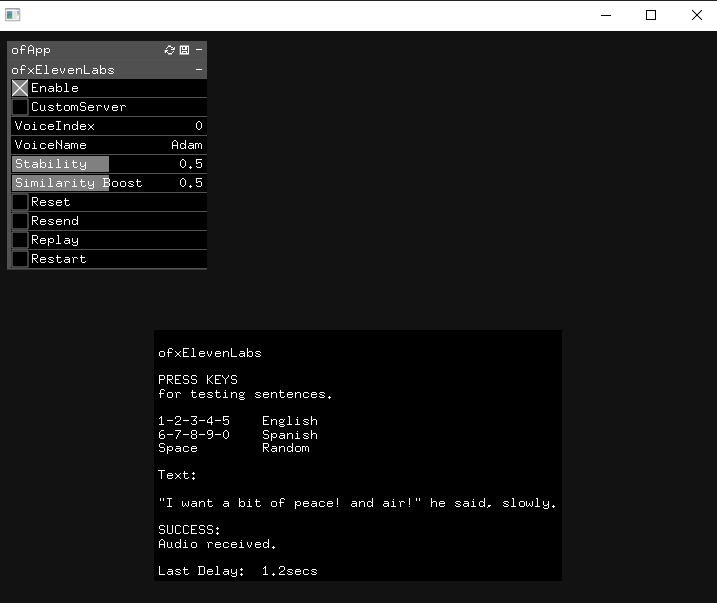

ofxElevenLabs
=============

# OVERVIEW

An [openFrameworks](https://openframeworks.cc/) addon for the 
[ElevenLabs](https://beta.elevenlabs.io/) **Text-to-Speech API**.



> Prime Voice AI.
The most realistic and versatile AI speech software, ever. Eleven brings the most compelling, rich and lifelike voices to creators and publishers seeking the ultimate tools for storytelling.

## FEATURES
- Simple `threading` to not block the drawing.
- Exposed and persistent `ofParameter` settings.
- Bundled Testing sentences workflow.

## IMPORTANT
- Sign-Up a free [ElevenLabs](https://beta.elevenlabs.io/sign-up) account before start. (_Currently, a free account has a limitation of 10.000 characters per month. Paid accounts start at 5$ / month._)
- Create your example project with the **PROJECT GENERATOR**.
- After the first app session, two JSON files will be created.
- Edit the `\example\bin\data\ofxElevenLabs_Server.json` file and set your `apiKey` from your profile.

## USAGE

### ofApp.h
```.cpp
#include "ofxElevenLabs.h"
ofxElevenLabs tts;
``` 

### ofApp.cpp
```.cpp
void ofApp::draw()
{
	tts.drawDebugHelp(); // optional
}

void ofApp::keyPressed(int key)
{
  tts.doSend("Hello, world");
}
```

## DEPENDENCIES
* **ofxGui**. Only for the example.  

## TESTED SYSTEMS
- **Windows 10** / **Visual Studio 2022** / **OF ~0.11.2**

## AUTHOR
An addon by **@moebiusSurfing**  
*( ManuMolina ) 2023.*  

### CONTACT / FOLLOW
<p>
<a href="mailto:moebiussurfing@gmail.com" target="_blank">Email</a> |  
<a href="https://www.instagram.com/moebiusSurfing/" target="_blank">Instagram</a> | 
<a href="https://moebiussurfing.itch.io/" target="_blank">itch.io</a> | 
<a href="https://www.youtube.com/moebiusSurfing" target="_blank">YouTube</a> | 
<a href="https://twitter.com/moebiusSurfing/" target="_blank">Twitter</a> | 
<a href="https://linktr.ee/moebiussurfing" target="_blank">Linktree</a>
</p>