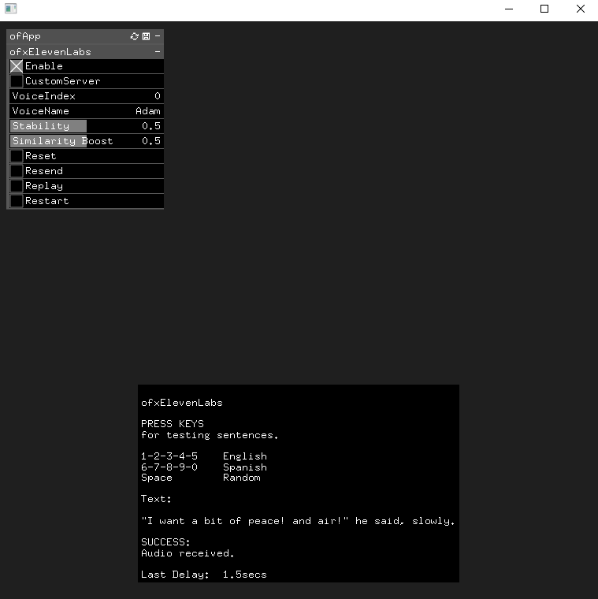

ofxElevenLabs
=============

An [openFrameworks](https://openframeworks.cc/) (C++) addon for the 
[ElevenLabs](https://beta.elevenlabs.io/) **Text-to-Speech API**.

> **Prime Voice AI**.  
The most realistic and versatile **AI speech software**, ever. Eleven brings the most compelling, rich and lifelike voices to creators and publishers seeking the ultimate tools for storytelling.  
> **ElevenLabs** offer high-quality pre-made voices, a **Voice Design feature** that allows you to create unique voices, and a cloning feature for replicating existing voices.

## VIDEO
[!](https://www.instagram.com/p/Cu9Iy05OdpC/?utm_source=ig_web_copy_link&igsh=MzRlODBiNWFlZA==)

## SCREENSHOT


## FEATURES
- Simple `threading` to not block the drawing.
- UI exposed and persistent `ofParameter` settings.
- Bundled Testing sentences workflow.

## IMPORTANT
- Sign-Up a free [ElevenLabs](https://beta.elevenlabs.io/sign-up) account before start.  
  - _Currently, a free account has a limitation of 10.000 characters per month. Paid accounts start at 5$ / month._
- Create your example project with the **OF PROJECT GENERATOR**.
- **Build**. After the first app session, two **JSON** files will be created.
  - Edit the `\example\bin\data\ofxElevenLabs_Server.json` file and set your `apiKey` from your [ElevenLabs profile](https://beta.elevenlabs.io/speech-synthesis).

## USAGE

#### ofApp.h
```.cpp
#include "ofxElevenLabs.h"

ofxElevenLabs tts;
```

#### ofApp.cpp
```.cpp
void ofApp::draw()
{
  tts.drawDebugHelp(); // Optional
}

void ofApp::keyPressed(int key)
{
  tts.doSend("Hello, world");
}
```

## DEPENDENCIES
* **ofxGui**. (_OF core_) Only for the example.  

## TESTED SYSTEMS
- **Windows 10** / **Visual Studio 2022** / **OF ~0.11.2**

## AUTHOR
An addon by **@moebiusSurfing**  
*( ManuMolina ) 2023.*  

### CONTACT / FOLLOW
<p>
<a href="mailto:moebiussurfing@gmail.com" target="_blank">Email</a> |  
<a href="https://www.instagram.com/moebiusSurfing/" target="_blank">Instagram</a> | 
<a href="https://moebiussurfing.itch.io/" target="_blank">itch.io</a> | 
<a href="https://www.youtube.com/moebiusSurfing" target="_blank">YouTube</a> | 
<a href="https://twitter.com/moebiusSurfing/" target="_blank">Twitter</a> | 
<a href="https://linktr.ee/moebiussurfing" target="_blank">Linktree</a>
</p>
